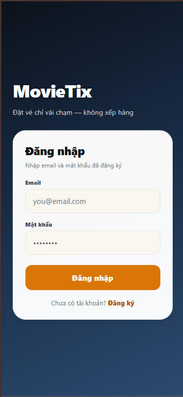
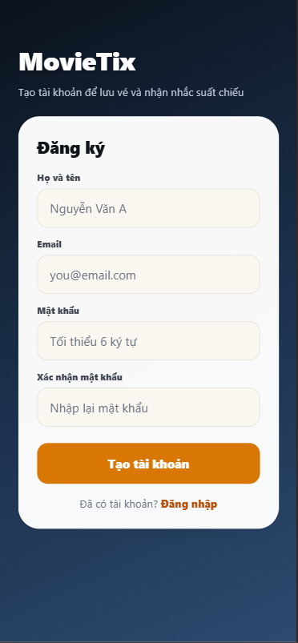
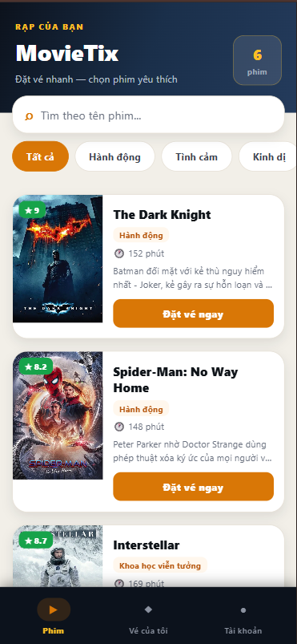
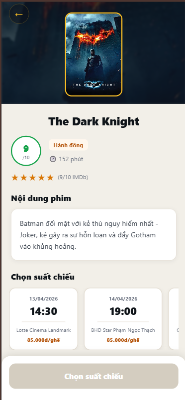
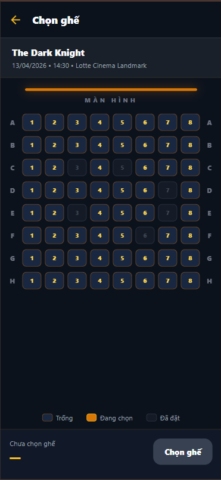

# 🎬 Movie Ticket App

Ứng dụng đặt vé xem phim trên mobile.

---

## 📱 Danh sách giao diện

### 1. Màn hình Đăng nhập

* Cho phép người dùng đăng nhập vào hệ thống
* Hỗ trợ nhập email và mật khẩu

📸 Ảnh minh họa:

---

### 2. Màn hình Đăng ký

* Người dùng tạo tài khoản mới
* Nhập thông tin cá nhân cần thiết

📸 Ảnh minh họa:

---

### 3. Màn hình Trang chủ

* Hiển thị danh sách phim đang chiếu
* Có thể tìm kiếm và lọc phim

📸 Ảnh minh họa:


---

### 4. Màn hình Chi tiết phim

* Hiển thị thông tin chi tiết của phim
* Bao gồm mô tả, thời lượng, thể loại

📸 Ảnh minh họa:

---

### 5. Màn hình Chọn ghế

* Người dùng chọn ghế trong rạp
* Hiển thị sơ đồ ghế

📸 Ảnh minh họa:

---

### 6. Màn hình Thanh toán

* Xác nhận thông tin vé
* Thực hiện thanh toán

📸 Ảnh minh họa:
*(Thêm ảnh tại đây)*

---

### 7. Màn hình Vé của tôi

* Hiển thị danh sách vé đã đặt
* Có thể xem chi tiết vé

📸 Ảnh minh họa:
*(Thêm ảnh tại đây)*

---

## 🛠️ Công nghệ sử dụng

* React Native (Expo)
* Firebase (Authentication / Database)

---

## 🚀 Hướng dẫn chạy project

```bash
npm install
npm start
```

Sau đó dùng app Expo Go để quét QR và chạy ứng dụng.

---
